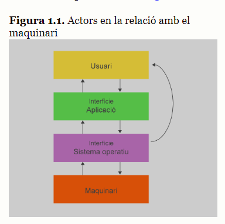
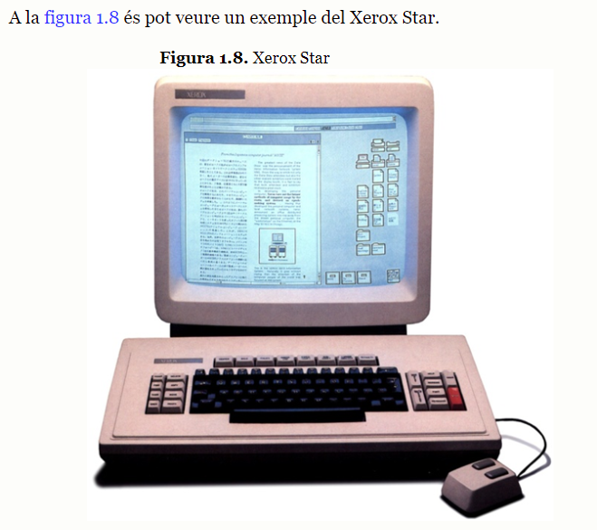
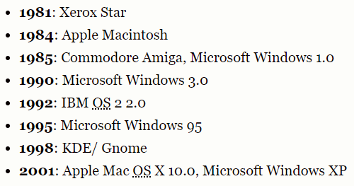

# 1. Confecció d'interfícies d'usuari

## 1.1. Introducció a les interfícies d’usuari

- de què s'encarrega el sistema operatiu?
  - de la gestió i la coordinació de les tasques que porten a terme un intercanvi d’informació entre els diferents recursos

- de què es compon el sistema operatiu?
  - un sistema d'entrada/sortida
  - gestió de processos
  - gestió de la memòria principal o del sistema d'arxius

- com actuarà el sistema operatiu?
  - actuarà d'interfície entre el maquinari i les aplicacions utilitzades

- on es troben les aplicacions?
  - per sobre del sistema operatiu , ja que el necessiten i s'adapten a ell
  - per sota dels usuaris

- on es troben les interfícies?
  - formen part de les aplicacions
  - són la part de les aplicacions amb la qual es relacionaran els usuaris

### 1.1.1. Què són les interfícies d’usuari?

- def. interfície d'usuari:
  - conjunt d’elements (que poden pertànyer al programari o al maquinari) que ofereixen una informació a l’usuari, i permeten, a més a més, la interacció (física o lògica) entre l’usuari i l’ordinador, per mitjà d’un dispositiu perifèric o un enllaç de comunicacions.

- GUI:
  - graphical user interface

- def. GUI:
  - són aquelles que fan servir elements gràfics, com poden ser menús, finestres o diàlegs, a més de l’ús d’altres recursos del sistema informàtic (perifèrics com el teclat, el ratolí o el so) per permetre a l’usuari interactuar amb l’ordinador de manera molt senzilla i intuïtiva

- funcions principals de les interfícies gràfiques d'usuari:
  - configuració de les interfícies gràfiques d’usuari i de l’entorn de treball
  - control d’accés a una aplicació informàtica
  - sistemes d’ajuda interactius
  - gestió i manipulació de directoris i arxius d’un sistema operatiu
  - arrancada i tancament d’un sistema informàtic mitjançant un sistema operatiu
  - intercanvi de dades entre diferents aplicacions
  - comunicació entre sistemes informàtics
  - ajuda al desenvolupament d’aplicacions informàtiques
  - gestió i manipulació de les funcionalitats que es puguin configurar en els sistemes informàtics

- def. CLI:
  - Acrònim de command line interface, és a dir, ‘interfície de línia d’instruccions’

- què permet la CLI?
  - permet als usuaris interactuar amb l’ordinador per mitjà de línies de text simples que contenen instruccions

- qui prefereix fer servir una interfície de tipus CLI abans que una interfície gràfica d'usuari?
  - els usuaris amb molts anys d'experiència

### 1.1.2. Evolució de les interfícies d’usuari

- 5 fases de l'evolució de les interfícies d'usuari:
  - 1. Interfícies d'usuari basades en la línia d'instruccions (fins als anys 70)
  - 2. Naixement de les interfícies d'usuari, cap a l'any 197
  - 3. Evolució envers les interfícies gràfiques d'usuari (1980-1995)
  - 4. Interfícies gràfiques d'usuari no basades en instruccions (1996-2001)
  - 5. Interfícies gràfiques d'usuari interactives (2002-ara)

#### (1960) Interfícies d'usuari basades en la línia d'instruccions

- què calia fer abans que existissin les interfícies d'usuari si voliem modificar la programació?
  - s'accedia directament al maquinari per fer les adequacions pertinents

- en quin any va arribar la interfície de línia d'instruccions?
  - als anys 60

- què permetia la interfície de línia d'instruccions?
  - interactuar amb l'ordinador amb una línia de text, que serviria com a text que portaria inclòs una ordre

#### (1970) Naixement de les interfícies d'usuari

- en quina dècada es comença a evolucionar envers l'ús d'un ordinador per part d'un únic usuari?
  - en el 1970

- què permetien els ordinadors dels anys 1970?
  - emmagatzemar informació
  - editar informació
  - compartir informació

- com acostumava a ser el disseny de les interfícies d'usuari del 1970?
  - dos dimensions
  - menús jeràrquics de pantalla complleta
  - tecles de funció per interactuar amb les aplicacions 

- en quin any l'empresa Xerox va desenvolupar l'ordinador Xerox Star?
  - 1981

#### (1980-1995) Evolució envers les interfícies gràfiques d'usuari GUI

- WIMP:
  - interfícies: windows, icons, menus and pointer
  - interfícies que disposen de punter per la pantalla i tenen finestres, icones i menús
  - ara hi ha 3 dimensions a la pantalla

- què permeten les GUI als usuaris?
  - treballar directament amb les funcionalitats que els interessen
  - ofereixen interacció amb els usuaris de forma directa
  - permet que l'usuari manipuli

- què va provocar l'ús més generalitzat dels ordinadors als anys 80?
  - el desenvolupament de GUIs massiu per part de les empreses

#### (1996-2001) Interfícies gràfiques d'usuari no basades en instruccions

- 

### 1.1.3. Tipus d’interfícies d’usuari

### 1.1.4. Elements de les GUI. Propietats i característiques

### 1.1.5. Eines de propietat i eines lliures d’edició d’interfícies

## 1.2. Eines de disseny d’Interfícies

### 1.2.1. Elements de les eines de desenvolupament d’interfícies

### 1.2.2. Components: característiques i camps d’aplicació

### 1.2.3. Finestra de quadre de components

### 1.2.4. Altres contenidors (panells)

### 1.2.5. Afegir/eliminar components a la interfície d’usuari

### 1.2.6. Ubicació i alineació de components. Modificació de propietats

### 1.2.7. Biblioteques de components disponibles per a diferents sistemes operatius i llenguatges de programació

## 1.3. Característiques especifiques de les eines de disseny d’interfícies

### 1.3.1. Controls: classes, propietats i mètodes

### 1.3.2. Diàlegs modals i no modals

### 1.3.3. Enllaç de components a orígens de dades. Datagrid

### 1.3.4. Els esdeveniments: concepte, associació d’accions, esdeveniments escoltadors.

### 1.3.5. Edició del codi generat per les eines de disseny

