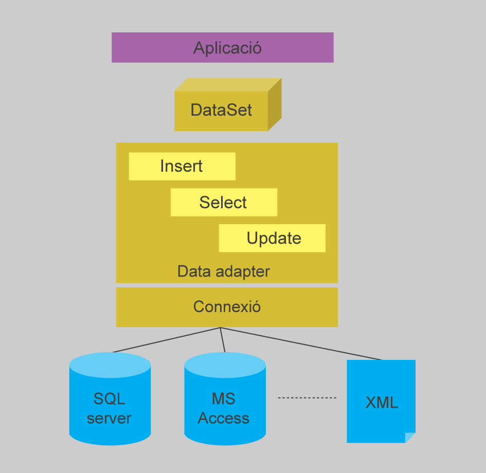
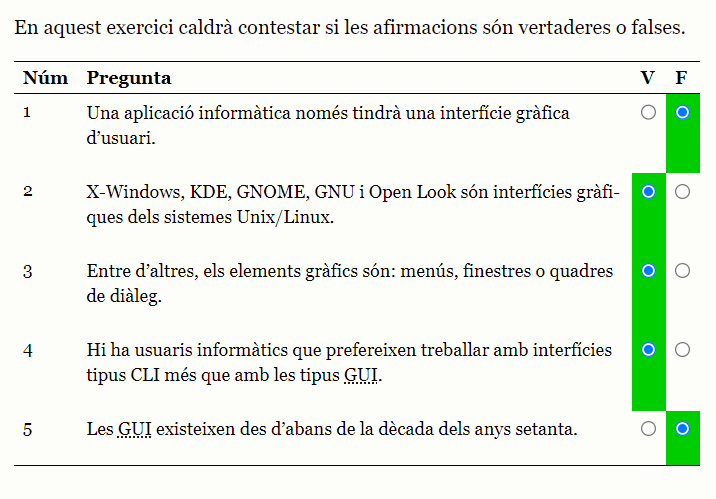
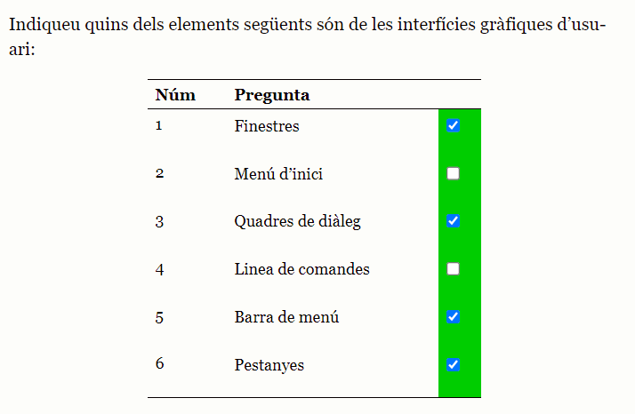
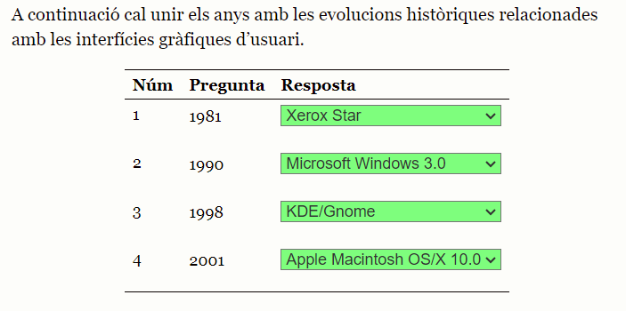
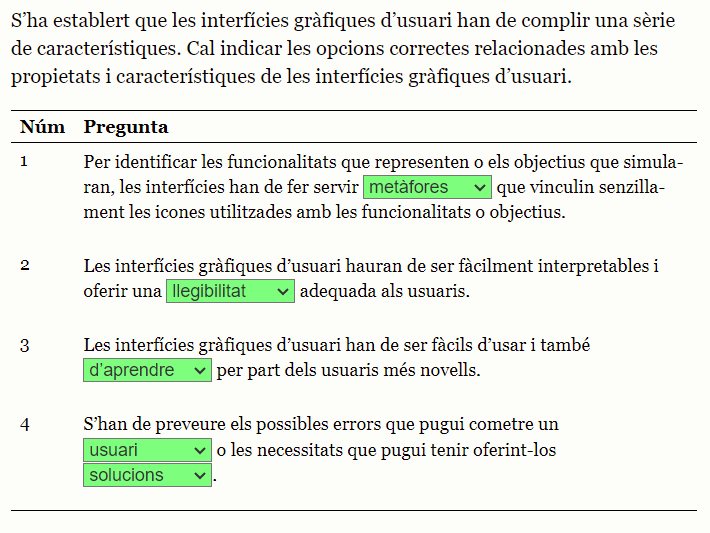
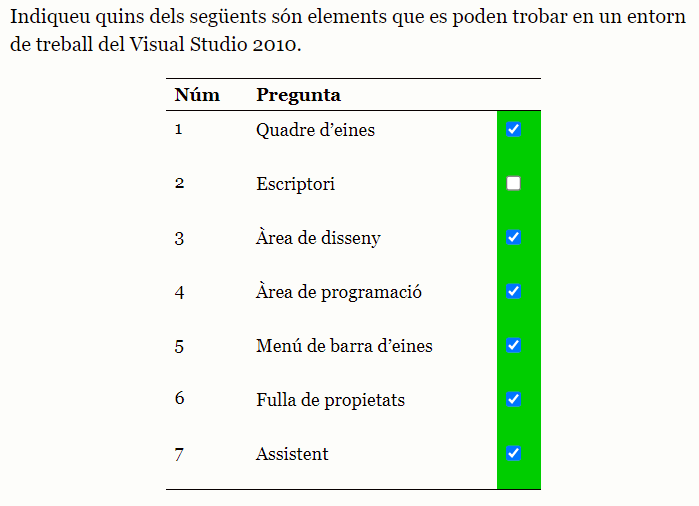

# 1. Confecció d'interfícies d'usuari

## 1.1. Introducció a les interfícies d’usuari


- de què s'encarrega el sistema operatiu?
  - de la gestió i la coordinació de les tasques que porten a terme un intercanvi d’informació entre els diferents recursos

- de què es compon el sistema operatiu?
  - un sistema d'entrada/sortida
  - gestió de processos
  - gestió de la memòria principal o del sistema d'arxius

- com actuarà el sistema operatiu?
  - actuarà d'interfície entre el maquinari i les aplicacions utilitzades

- on es troben les aplicacions?
  - per sobre del sistema operatiu , ja que el necessiten i s'adapten a ell
  - per sota dels usuaris

- on es troben les interfícies?
  - formen part de les aplicacions
  - són la part de les aplicacions amb la qual es relacionaran els usuaris

### 1.1.1. Què són les interfícies d’usuari?

- def. interfície d'usuari:
  - conjunt d’elements (que poden pertànyer al programari o al maquinari) que ofereixen una informació a l’usuari, i permeten, a més a més, la interacció (física o lògica) entre l’usuari i l’ordinador, per mitjà d’un dispositiu perifèric o un enllaç de comunicacions.

- GUI:
  - graphical user interface

- def. GUI:
  - són aquelles que fan servir elements gràfics, com poden ser menús, finestres o diàlegs, a més de l’ús d’altres recursos del sistema informàtic (perifèrics com el teclat, el ratolí o el so) per permetre a l’usuari interactuar amb l’ordinador de manera molt senzilla i intuïtiva

- funcions principals de les interfícies gràfiques d'usuari:
  - configuració de les interfícies gràfiques d’usuari i de l’entorn de treball
  - control d’accés a una aplicació informàtica
  - sistemes d’ajuda interactius
  - gestió i manipulació de directoris i arxius d’un sistema operatiu
  - arrancada i tancament d’un sistema informàtic mitjançant un sistema operatiu
  - intercanvi de dades entre diferents aplicacions
  - comunicació entre sistemes informàtics
  - ajuda al desenvolupament d’aplicacions informàtiques
  - gestió i manipulació de les funcionalitats que es puguin configurar en els sistemes informàtics

- def. CLI:
  - Acrònim de command line interface, és a dir, ‘interfície de línia d’instruccions’

- què permet la CLI?
  - permet als usuaris interactuar amb l’ordinador per mitjà de línies de text simples que contenen instruccions

- qui prefereix fer servir una interfície de tipus CLI abans que una interfície gràfica d'usuari?
  - els usuaris amb molts anys d'experiència

### 1.1.2. Evolució de les interfícies d’usuari

- 5 fases de l'evolució de les interfícies d'usuari:
  - 1. Interfícies d'usuari basades en la línia d'instruccions (fins als anys 70)
  - 2. Naixement de les interfícies d'usuari, cap a l'any 197
  - 3. Evolució envers les interfícies gràfiques d'usuari (1980-1995)
  - 4. Interfícies gràfiques d'usuari no basades en instruccions (1996-2001)
  - 5. Interfícies gràfiques d'usuari interactives (2002-ara)

#### (1960) Interfícies d'usuari basades en la línia d'instruccions

- què calia fer abans que existissin les interfícies d'usuari si voliem modificar la programació?
  - s'accedia directament al maquinari per fer les adequacions pertinents

- en quin any va arribar la interfície de línia d'instruccions?
  - als anys 60

- què permetia la interfície de línia d'instruccions?
  - interactuar amb l'ordinador amb una línia de text, que serviria com a text que portaria inclòs una ordre

#### (1970) Naixement de les interfícies d'usuari

- en quina dècada es comença a evolucionar envers l'ús d'un ordinador per part d'un únic usuari?
  - en el 1970

- què permetien els ordinadors dels anys 1970?
  - emmagatzemar informació
  - editar informació
  - compartir informació

- com acostumava a ser el disseny de les interfícies d'usuari del 1970?
  - dos dimensions
  - menús jeràrquics de pantalla complleta
  - tecles de funció per interactuar amb les aplicacions 

- en quin any l'empresa Xerox va desenvolupar l'ordinador Xerox Star?
  - 1981


#### (1980-1995) Evolució envers les interfícies gràfiques d'usuari GUI

- WIMP:
  - interfícies: windows, icons, menus and pointer
  - interfícies que disposen de punter per la pantalla i tenen finestres, icones i menús
  - ara hi ha 3 dimensions a la pantalla

- què permeten les GUI als usuaris?
  - treballar directament amb les funcionalitats que els interessen
  - ofereixen interacció amb els usuaris de forma directa
  - permet que l'usuari manipuli

- què va provocar l'ús més generalitzat dels ordinadors als anys 80?
  - el desenvolupament de GUIs massiu per part de les empreses


#### (1996-2001) Interfícies gràfiques d'usuari no basades en instruccions

- en quin any van aparèixer els sistemes operatius que interactuen amb els usuaris amb GUI?
  - a partir de l'any 1995

#### (2002-ara) Interfícies gràfiques d'usuari interactives

- quina va ser la primera nova dimensió que es va incorporar ?
  - la de fer servir elements multimèdia

- exemple d'element multimèdia:
  - incorporació d'imatges a les interfícies, de sons o d'animacions

- quin concepte podriem considerar com a tercera dimensió?
  - el concepte de temps

- quin concepte podriem considerar com a quarta dimensió?
  - el concepte de comunicació verbal

### 1.1.3. Tipus d’interfícies d’usuari

- què caldrà tenir en compte a l'hora de dissenyar una interfície?
  - el nivell de coneixement dels usuaris de les aplicacions

- def. WIMP:
  - estil d’interacció que fa servir normalment un ratolí per controlar la ubicació d’un cursor que s’anirà desplaçant per les interfícies. Un altre element important del WIMP és la utilització de finestres per presentar la informació de manera organitzada. També es fan servir icones i menús per oferir les funcionalitats adients als usuaris.

- què cerca l'estil d'interacció WIMP?
  - reduir el temps d’aprenentatge que necessitarà un usuari per utilitzar de manera òptima una interfície gràfica facilitant el record de les opcions que ofereix. A la vegada serà més senzilla de fer servir per part d’usuaris no experts.

- 4 tipus d'interfícies segons la manera d'interaccionar amb els ususaris:
  - 1. interfícies de línia d'instruccions (CLI): alfanumèriques 
  - 2. interfícies gràfiques d'usuari (GUI): representació gràfica dels elements
  - 3. pantalles tàctils: s'han d'adaptar a les necessitats del dispositiu d'entrada i de sortida alhora
  - 4. dispositius mòbils: 

- 3 tipus d'interficies segons els elements amb els que s'ha construït:
  - 1. de maquinari: es tracta d’interfícies que permeten la interacció entre l’usuari i el sistema informàtic mitjançant elements de maquinari, dispositius com polsadors o lectors de barres o altres reguladors o instruments
  - 2. de programari: aquestes són les interfícies desenvolupades per a ordinadors que basen la seva creació en desenvolupament de programari, mitjançant el qual es durà a terme tota la interacció amb els usuaris
  - 3. de programari-maquinari: són interfícies que compartiran els dos tipus explicats anteriorment. Per una banda interfícies de programari amb algun element o dispositiu de maquinari necessari per recollir algun tipus d’informació específica (per exemple, un lector de codi de barres)

- classificació de les interfícies segons l'arquitectura de les aplicacions:
  - 1. aplicacions locals: interfícies Winforms: es desenvolupen per treballar en una única màquina un únic usuari a la vegada. S’haurà pogut desenvolupar en diferents llenguatges de programació i es podrà haver vinculat a diferents tipus de bases de dades, però es trobaran instal·lades en una màquina que serà l’únic lloc des d’on es podrà fer servir
  - 2. aplicacions client-servidor: basades en el treball en més d’una màquina, en què una farà de servidor i la resta (una o moltes més) faran de clients que accedeixen remotament al servidor per accedir a les dades o a les funcionalitats. Cal fer una instal·lació a la màquina servidor i una altra instal·lació a cada una de les màquines client
  - 3. aplicacions web: tipus específic de les aplicacions client/servidor. Aquest tipus d’aplicacions permet accedir a dades i funcionalitat per mitjà de les xarxes telemàtiques, i l’accés més habitual és el que es fa per mitjà d’un navegador d’Internet, que accedeix a un servidor web, on es localitzaran les dades i la implementació de les funcionalitats

- classificació de les interfícies segons el programari on es desenvoluparan:
  - 1. plataformes RichClient: eines de desenvolupament de programari que contindran tots els elements necessaris per dissenyar i desenvolupar sense cap altra necessitat una interfície gràfica d’usuari
  - 2. plataformes ThinClient: eines de desenvolupament de programari que necessiten d’altres eines per a poder dissenyar i desenvolupar interfícies gràfiques d’usuari i parts de programari

### 1.1.4. Elements de les GUI. Propietats i característiques

- quin ha estat l'objectiu de totes les GUI?
  - oferir als usuaris unes interfícies amb usabilitat òptima

- característiques que han de complir les GUI:
  - 1. accessible i intuïtiva: una interfície ha de ser intuïtiva en el seu ús, ha de mostrar amb claredat les funcionalitats que ofereix i ha de facilitar arribar-hi de manera senzilla i clara
  - 2. ús de metàfores: per identificar les funcionalitats que representen o els objectius que simularan, les interfícies han de fer servir metàfores que vinculin senzillament icona o imatge amb funcionalitat o objectiu
  - 3. aprenentatge i ús fàcil: les interfícies han de ser fàcils d’usar i també d’aprendre per part dels usuaris més novells
  - 4. consistència: les interfícies han de seguir un mateix disseny i estructura entre elles i també amb altres interfícies d’aplicacions anàlogues. També hauran de ser consistent quan s’executin en diferents entorns
  - 5. oferir el control de les interfícies: una interfície ha de saber lliurar el seu control a l’usuari que la farà servir
  - 6. anticipació: s’hauran de preveure els possibles errors que pugui cometre un usuari o les necessitats que pugui demostrar i oferir-hi solucions abans que apareguin o controlant-los i oferint solucions
  - 7. llegibilitat: hauran de ser fàcilment interpretables i oferir una llegibilitat adequada als usuaris: una interfície ha de saber lliurar el seu control a l’usuari que la farà servir
  - 8. autonomia: un usuari no ha de necessitar més informació o ajuda que la que una interfície li ofereix o, la que pot trobar a partir de les indicacions que li indicarà aquesta interfície
  - 9. reduir càrrega de memòria: per poder fer servir una interfície més d’una vegada no caldrà obligar als usuaris a recordar la ubicació de les funcionalitats, sinó que aquestes hauran de ser senzilles de trobar. Això farà que no sigui indispensable memoritzar moltes informacions per aprendre a fer servir una interfície determinada
  - 10. internacionalització de la interfície: ha de permetre ser entesa i utilitzable per usuaris de diferents cultures i idiomes o bé fent-la internacional amb icones fàcilment reconeixibles o amb la possibilitat de seleccionar l’idioma amb el qual es voldrà treballar
  - 11. valors inicials: també coneguts com a valors per defecte o estàndard. Són els valors que en les interfícies que porten un formulari incorporat apareixeran seleccionats inicialment. A més, han de poder ser descartats de manera senzilla
  - 12. llei de fitts: una interfície ha d’aconseguir optimitzar la llei de Fitts. Aquesta llei, en ergonomia, modelarà el moviment humà, fent una estimació del temps que pot necessitar un ésser humà per moure un punter des d’una zona de la pantalla fins a una altra tenint en compte variables com els objectius, la distància fins a assolir-los i la grandària que tindran

#### Finestres

- def. finestres (windows):
  - són, normalment, bidimensionals i de forma rectangular, i s’ubicaran a l’escriptori del sistema operatiu

- quines possibilitats ofereix el fet de treballar amb finestres?
  - ofereix la possibilitat de tenir dos documents ofimàtics oberts (un full de càlcul i un document de text) i anar alternant la informació escrita en tots dos documents o anar copiant informació d’un document a un altre

#### Quadres de diàleg

- def. quadres de diàleg:
  - són un tipus de finestres, també considerades com a finestres secundàries

- com apareixen els quadres de diàleg?
  - apareixen per sobre de la resta de finestres demanant una interacció concreta a l’usuari, que l’haurà de contesta

#### Assistents

- def. assistents:
  - són finestres que van apareixent una darrere de l’altra fins que s’arriba a un determinat objectiu. Com el seu nom indica, assisteixen l’usuari fins a completar una funcionalitat, preguntant pas per pas totes les informacions necessàries fins a completar-la correctament

#### Menús

- def. menús:
  - seran els encarregats de mostrar totes les possibilitats d’interactuar amb l’aplicació informàtica

- 3 tipus de menús:
  - 1. menús jeràrquics: menús representats en forma d’arbre, amb un nombre de nivells horitzontal (opcions del menú) i un nombre determinat de nivells verticals (fins on podrà arribar l’usuari navegant pel menú). Les opcions que es troben a un nivell tindran correspondència entre elles. Són utilitzats de manera habitual en sistemes operatius i aplicacions de tota índole
  - 2. menús contextuals: no es trobaran visibles a la interfície fins que l’usuari no en provoqui l’activació. Són menús que s’obriran en una nova finestra flotant, que variaran en funció de la ubicació del ratolí en el moment de cridar-los (normalment fent clic amb el botó dret del ratolí). D’aquesta manera, serà diferent el menú que apareixerà si es fa clic a sobre del marc de la finestra o si es fa clic a sobre de l’àrea de treball
  - 3. menús de navegació (scrolls): es poden considerar una evolució dels menús jeràrquics. Es tracta d’un tipus de menú que mostra només les opcions més utilitzades dels menús, i n’oculta la resta, però deixant visible una petita icona que, en ser seleccionada, mostra tota la resta de les opcions del menús

#### Pestanyes

- def. pestanyes:
  - són un element que permet mostrar un conjunt de dades o de funcionalitats relacionades entre si de manera agrupada. En una mateixa finestra es podran mostrar els continguts de tantes finestres com es vulgui, separant-les per pestanyes, que hauran de tenir un títol i contenir informacions relacionades

#### Barres d'eines

- def. barres d'eines:
  - faciliten l’accés a algunes funcionalitats mitjançant una icona. Totes les funcionalitats oferides a les barres d’eines es podran trobar desenvolupades als menús, però no totes les opcions que ofereixen els menús es podran trobar a les barres d’eines

#### Icones

- def. icones:
  - imatges que representen funcionalitats o accions que es podran dur a terme fent un clic a sobre. Entre d’altres llocs, a les interfícies gràfiques d’usuari, són elements que es fan servir a les barres d’eines

#### Entorn de treball

- def. entorn de treball:
  - És un element més de les interfícies, com ho són els menús, les barres d’eines o molts altres. Es tracta de la ubicació principal de les informacions amb les quals s’interactua amb l’usuari, on es mostrarà el text, les imatges o les dades que l’usuari haurà demanat mitjançant els menús

#### Tipografies

#### Controls

- def. controls:
  - proporcionen funcions a la interfície d’usuari que permetran moltes més possibilitats en les interaccions entre interfície i usuari

- 3 tipus de botons (que formen part dels controls):
  - 1. Botons en forma de radi (radio buttons): són elements que es fan servir en formularis o en menús per donar a seleccionar a l’usuari una opció entre una llista. Aquests botons en forma de radi són botons rodons que podran ser escollits per mitjà d’accions d’usuari
  - 2. Botons de confirmació (check box): botons de forma quadrada molt semblants als de radi, també per poder seleccionar opcions d’una llista d’opcions. La diferència amb els botons en forma de radi serà que en els botons de confirmació es podrà seleccionar més d’una opció entre les mostrades, i en canvi en els botons en forma de radi només se’n pot seleccionar una
  - 3. Botons en relleu: aquest tipus de botons imita un botó d’un dispositiu físic que simula un volum, i dóna així la possibilitat de tenir diversos estats (activat o no, seleccionat o no), a més de poder incloure text amb la definició de la funcionalitat que representarà

### 1.1.5. Eines de propietat i eines lliures d’edició d’interfícies

- com podem accedir a un entorn gràfic si treballem amb llenguatges de tercera generació?
  - treballant amb biblioteques

- com podem accedir a un entorn gràfic si treballem amb llenguatges de quarta generació?
  - treballant amb components gràfics i d'accés incorporats

- def. eines de creació i edició d'interfícies:
  - són un tipus de programari que ajudarà al programador a desenvolupar interfícies que segueixin les indicacions establertes en la fase de disseny a partir de l’anàlisi de les necessitats. Hauran de tenir en compte totes les fases de desenvolupament d’un projecte informàtic

## 1.2. Eines de disseny d’Interfícies

### 1.2.1. Elements de les eines de desenvolupament d’interfícies

- 6 elements en l'entorn de treball d'una aplicació de disseny:
  - 1. menús
  - 2. menú de barra d'eines
  - 3. àrea de disseny
  - 4. quadre d'eines
  - 5. full de propietats
  - 6. assistent

### 1.2.2. Components: característiques i camps d’aplicació

- def. temps de disseny:
  - quan s’estan desenvolupant les interfícies d’una aplicació informàtica

- def. temps d'execució:
  - quan l’usuari està executant l’aplicació i hi està interactuant

- def. component:
  - un objecte que es podrà reutilitzar, que permet interactuar amb altres objectes i proporciona el control sobre determinats recursos externs en temps de disseny. Els components es podran dissenyar i configurar, cosa que fa que es pugui fer servir en una eina tipus IDE. Un component es podrà afegir al quadre d’eines, es podrà seleccionar i arrastrar cap a un plafó o formulari i es podran modificar les seves característiques. Totes aquestes accions es podran dur a terme en temps de disseny. Els components podran ser visibles o no visibles per a l’usuari a la interfície. Un component que es fa no visible per a l’usuari ofereix algunes possibilitats per al desenvolupador que multipliquen les seves possibilitats a l’hora de crear una interfície

- exemples de components simples:
  - botons, llistes desplegables, barres de progrés, etiquetes, botons de radi…

- def. control:
  - tipus de component. Altres indiquen que són objectes similars als components, en poder-se dissenyar i configurar. El que sí que és clar és que un control és un objecte que proporciona una interfície a l’usuari, i permet la interacció entre usuari i aplicació per intercanviar informació

- exemples de controls:
  - botons, els quadres de llistes, els quadres d’edició…

- def. panell:
  - És un control que servirà per fer de contenidor d’altres controls. És una eina adequada per ocultar o mostrar un tipus de controls determinats. Aquest tipus de control podrà tenir barres de desplaçament del control a més de poder personalitzar les seves característiques i propietats de presentació. Un tipus de contenidor serà una barra d’eines

- def. formulari:
  - És un tipus de component que serà com una finestra que el desenvolupador, en el temps de disseny, podrà utilitzar per ubicar altres components o controls. Un formulari pot existir per ell sol o pot formar part d’un conjunt de formularis. Com a exemples de formulari es tenen les finestres amb marc o sense, els quadres de diàleg…

### 1.2.3. Finestra de quadre de components

- def. finestra del quadre d'eines:
  - conté els components i altres elements que es poden fer servir a les interfícies que es desenvolupen a l’àrea de disseny. Per afegir un component cal seleccionar-lo amb el ratolí i arrossegar-lo fins a l’àrea de disseny dintre d’un formulari

### 1.2.4. Altres contenidors (panells)

- quins objectes poden funcionar com a contenidors d'altres controls o components?
  - Form
  - GroupBoc
  - Panel
  - tots tres hereten de la classe ContainerControl

- def. Classe:
  - En un context de POO (programació orientada a objectes), una classe és un conjunt de propietats i mètodes relacionats amb un significat propi.

- def. Herència:
  - En un context de POO és un tipus de relació entre classes, en què una deriva d’una segona, cosa que permet la reutilització i extensió del programari. Permet la creació d’una jerarquia de classes.

### 1.2.5. Afegir/eliminar components a la interfície d’usuari

- com podem afegir un nou control a un formulari:
  - 1. tenr obert un formulari on es vol ubicat el control a l'àrea de disseny
  - 2. obrir la finestra amb el quadre d'eines
  - 3. seleccionar el grup i el control o component que volem
  - 4. fer clic sobre el formulari o arrossegar-lo fins al formulari en el qual es vulgui encabir perquè formi part d’aquella interfície
  - 5. donar-li les mides que volguem

### 1.2.6. Ubicació i alineació de components. Modificació de propietats

### 1.2.7. Biblioteques de components disponibles per a diferents sistemes operatius i llenguatges de programació

## 1.3. Característiques especifiques de les eines de disseny d’interfícies

### 1.3.1. Controls: classes, propietats i mètodes

- def. objecte:
  - En un context de programació orientada a objectes, un objecte és una instancia a una classe.

- def. controls:
  - són objectes que permeten un desenvolupament de les interfícies més senzill gràcies a la seva possibilitat de modularitat i reutilització. Els controls tenen propietats i mètodes, i es podran associar a esdeveniments

- què ofereixen els controls?
  - un ventall de possibilitats molt gran als desenvolupadors, en possibilitar dotar d’unes mateixes característiques a un conjunt de controls que es faran servir per a interfícies directament relacionades o poder utilitzar un mateix control en diversos projectes de desenvolupament de programari

- 3 característiques dels controls:
  - 1. propietats
  - 2. mètodes (procediments i funcions)
  - 3. esdeveniments

- def. propietats:
  - característiques que identifiquen cada control. Aquests són el que són a partir de les parts que constitueixen l’objecte. Per exemple, una persona es podria dir que presenta propietats com podrien ser els seus ulls, les orelles, els llavis, l’alçada, el pes… Aquestes propietats poden tenir uns valors (per exemple Ulls = Verds, Orelles = Grans, Llavis = Fins, etc.) que faran que aquella persona sigui identificable respecte d’una altra per aquelles característiques. De la mateixa manera passa amb els controls

- def. mètodes:
  - són els procediments o funcions associats a un control, els quals permeten fer certes operacions útils sobre aquest control i obtenir-ne una resposta. Per exemple, un mètode d’un RadioButton permet ordenar alfabèticament els seus components o bé un altre mètode permet fer una cerca d’una dada concreta.

- diferència entre procediments i funcions:
  - els procediments no retornen cap valor, mentre que les funcions sempre retornen un sol valor

- def. esdeveniment:
  - és una acció determinada que es pot fer vinculada amb un control

### 1.3.2. Diàlegs modals i no modals

- def. quadre de diàleg:
  - finestra que apareixerà oferint una informació als usuaris en un moment determinat de l’execució d’una interfície

- quan un quadre de diàleg és modal?
  - quan l’aplicació mateixa o el formulari que l’ha cridat no pot rebre cap esdeveniment fins que no s’hagi tancat el quadre de diàleg

- quan un quadre de diàleg no és modal?
  - quan l’aparició del quadre de diàleg no limita l’usuari de continuar interactuant amb la resta de finestres. En altres paraules, els quadres de diàleg modals són aquells formularis que fins que no es tanquen no deixen continuar amb l’aplicació

- def. quadre de missatge:
  - quadre de diàleg modal que es pot utilitzar per mostrar informació textual i permetre que els usuaris prenguin decisions amb botons.

- def. quadres de diàlegs comuns:
  - poden ser tan modals com no modals. L’entorn Windows implementa diversos quadres de diàleg reutilitzables que són comuns per a totes les aplicacions, incloent-hi quadres de diàleg per obrir arxius, desar arxius i imprimir

### 1.3.3. Enllaç de components a orígens de dades. Datagrid

- def. enllaç de dades:
  - mecanisme proporcionat per algunes plataformes que permeten, en aplicacions amb interfície Windows o en aplicacions web, enllaçar objectes contenidors de dades amb els controls de formulari, per poder fer operacions de navegació i edició

- def. DataSets ADO.NET:
  - representació d’un conjunt complet de dades (taules, camps, relacions…) que resideix en memòria i ofereix un model de programació independent de l’origen de les dades

- és possible enllaçar dades (Databind) amb els controls de formularis?
  - si, no solament des d’orígens de dades tradicionals (com DataSets ADO .NET), sinó també a gairebé qualsevol estructura que contingui dades, com estructures, col·leccions, propietats i altres controls

#### simple data binding

- def. simple data binding:
  - associació entre un control, que pot mostrar una única dada, i l’objecte que actua com a contenidor de dades, com ara l’enllaç entre un control TextBox o una etiqueta i un objecte DataColumn d’una DataTable d’un DataSet

- exemple de vinculació del camp NomColumna de la taula NomTaula a un control de tipus TextBox:
```java
Me.SqlDataAdapter1.Fill(Me.DataSet1, "NomTaula")
Dim bind As Binding
bind = New Binding("Text", Me.DataSet1.Tables("NomTaula"), "NomColumna")
Me.TextBox1.DataBindings.Add(bind)
```
#### complex data bindings

- def. complex data bindings:
  - Aquest tipus d’enllaç és possible entre un control que pot actuar com a interfície o visualitzador de dades, ja que disposa de la capacitat de mostrar diverses o totes les dades, normalment més d’un registre, de l’objecte contenidor de dades

- def. objecte DataSet:
  - és un objecte independent que emmagatzema temporalment les dades. Es pot considerar com un conjunt de registres que sempre està desconnectat i que no sap res sobre l’origen i la destinació de les dades que conté. Dins d’un objecte DataSet, de la mateixa manera que dins d’una base de dades, hi ha taules, columnes, relacions, restriccions, vistes, etc.

- def. objecte DataAdapter:
  - és l’objecte que es connecta a la base de dades per omplir l’objecte DataSet. Si és necessari, es torna a connectar a la base de dades per actualitzar les dades de la base de dades a partir de les operacions fetes en les dades contingudes en l’objecte DataSet (operacions d’inserció, modificació o eliminació)

- def. objecte DataReader:
  - proporciona una manera de llegir una seqüència de registres de dades només cap endavant des d’un origen de dades SQL Server

- def. Connection:
  - permet connectar amb una base de dades i administrar les transaccions en una base de dades

- def. Command:
  - permet emetre ordres SQL a una base de dades



### 1.3.4. Els esdeveniments: concepte, associació d’accions, esdeveniments escoltadors.

- 6 esdeveniments més comuns:
  - 1. MouseMove: en moure el ratolí per sobre d’un control
  - 2. MouseDown: en prémer qualsevol botó del ratolí
  - 3. Change: en canviar el contingut del control
  - 4. Click: en fer clic amb el botó esquerre del ratolí sobre el control
  - 5. GetFocus: aquest esdeveniment s’activa quan el control rep l’enfocament, és a dir, quan s’activa el control en temps d’execució per introduir-hi dades o fer alguna operació
  - 6. LostFocus: és el contrari de l’esdeveniment anterior, s’activa quan el control perd l’enfocament, és a dir, es passa a un altre control per seguir introduint dades

### 1.3.5. Edició del codi generat per les eines de disseny

- def. entors integrats de desenvolupament i les altres eines de disseny i desenvolupament d'interfícies:
  - són aplicacions que permeten dissenyar interfícies gràfiques d’usuari sense necessitat de programar una sola línia de codi. Però en molts pocs casos un desenvolupador obtindrà un producte final sense la necessitat d’haver de modificar algun detall al qual no haurà arribat l’aplicació de desenvolupament.









